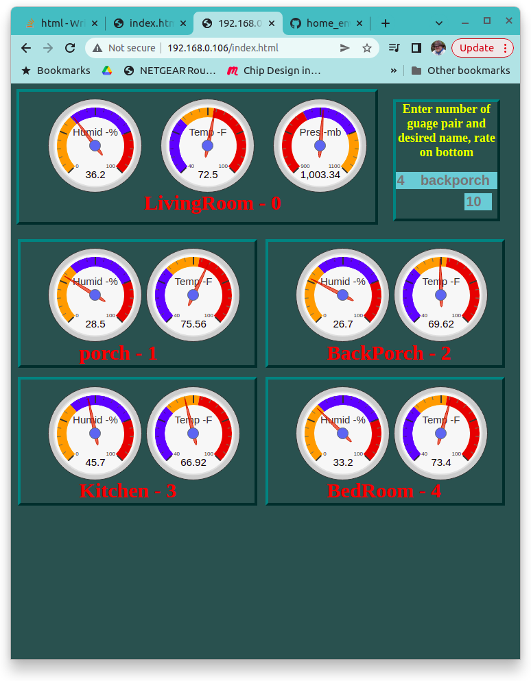

## Home Environment Monitor
</img>
##### A system is presented that connects a group of remote clients, each having several sensors, distributed over a local area network witc a base server. The remote clients, at a periofic rate, collect their data and report it to the base server. The server reponds with a slot assigngment number and the remote stations assigned name. The base server collects the latest data from all the remote clients as well as its' own sensors data. Another type for client request from a browser, or a netcat command from a pc, will cause the server to return the data from all of the sensors on the network. An index.html file is shown that displays this data with google visualization gauges and a perl program is described that collects the sensor data, time stamps it and stores it in file.
##### The system is implemented with an esp32 wroom as the base server with the remotes being various types of esp8266 modules at hand (mostly mini D1s and a few esp01s). Sensors included in project included one bmp280 atmospheric pressure sensor and an handful of humidity/temperature sensors (ath10, dht11 and dht22s). The host esp32 is running a tcp server task and periododicly interfaces with three on board i2c devices- data is collected from an aht10 (humidity and temperature) and a bmp280 (atmospheric pressure) sensor - data is written to a ssd1306 display. A potentially large number of remote esp8266s, running a tcp client, are equiped with a humity and temperature sensor and distributed around the house and backyard.
##### The esp portion of the project is written in the espressif idf envirornment. The project functionality was merged from various examples included with the idf distribution, specifically the wifi connection example was used with little alteration. The i2c and tcp server examples were modified to suit purposes. Pretty much all the rest of the software is written from scratch. idf drivers for the dhts11/22, aht10, bmp280 and ssd1306 were either nonexistant or too confusing (several of these devices have aweful datasheets also). The repository https://github.com/baetis-ma/esp32-max30102-website and the github page at https://baetis-ma.github.io/esp32-idf-website/ describe getting started with esp idf with a simple webpage.
##### The esp8266 tcp client remotes, independently, periodically collect data from it's sensors and sends a tcp packet with the following resources 
1. regitration number assigned by host (or a zero to request registration)
2. the clients ip address
3. assigned station name
4. humidity measurement
5. temperature measurement 
##### The remotes waits for response from host consisting of 
1. regisration number
2. assigned station name
3. the rate to take samples
##### The esp32 tcp base server receives three different types of requests, namely 
1. index.html request
2. a client request as described above
3. a client request to read the collected sensor data and assign remote names.
##### The third type of client request can be originated from the JavaScript within the index.html being run in a browser or from a perl program running netcat commands every few minutes for the purpose of data logging. The url resources contained in a request consist of 
1. regisration number
2. station name to be assigned to regration number
3. rate in seconds of updates for data collection and webpage. 
##### The tcp response is 
1. number of registered devices
2. name assigned to station
3. pressure measurement
4. humidity measurement
5. temperature measurement
6. name of station register to slot 1
7. humidty measurement
8. temperature measurement
      items 6-8 will repeat for each registered station.
##### The webpage displays the state of all the sensor measurements across the system with Google chart gauge visualizations, as new remotes are added new gauges appear on webpage and as gauges timeout they disappear. The webpage also includes text action boxes for station naming - for example stations can be named backporch or kitchen, ect... The rate of data aquistion is also set at this level.

##### A perl program is used to log environmental data. It can be set to collect data every 10 minutes, for example, and save data to disk. Notice that the webpage gives a snap shot updated every few seconds or minutes while the perl program provides a history of weeks or years worth of data.
```
#!/usr/bin/perl
use strict;
use warnings;
use POSIX qw/strftime/;

my $ret = `printf "GET /host?0,host,8 HTTP/1.0\r\n\r\n" | nc 192.168.0.106 80`; 
$ret =~ tr/ //ds;
my @inarray = split (/,/, $ret);

printf("%s  ", strftime('%Y/%m/%d  %H:%M:%S',localtime));
print "@inarray";

printf ("%s %s %s\n", strftime('%Y/%m/%d  %H:%M:%S',localtime), $inarray[1], $inarray[4]); 

open(FH, '>>', "./${inarray[1]}.pressure");
printf  FH "%s %s\n", strftime('%Y/%m/%d  %H:%M:%S',localtime), $inarray[4];
open(FH, '>>', "./${inarray[1]}.hum");
printf  FH "%s %s\n", strftime('%Y/%m/%d  %H:%M:%S',localtime), $inarray[2];
open(FH, '>>', "./${inarray[1]}.temp");
printf  FH "%s %s\n", strftime('%Y/%m/%d  %H:%M:%S',localtime), $inarray[3];

for(my $a=1; $a <= $inarray[0]; $a++) {
   open(FH, '>>', "./${inarray[5 + 3*($a-1)]}.hum");
   printf  FH "%s %s\n", strftime('%Y/%m/%d  %H:%M:%S',localtime), $inarray[6 + 3*($a-1)];
   open(FH, '>>', "./${inarray[5 + 3*($a-1)]}.temp");
   printf  FH "%s %s\n", strftime('%Y/%m/%d  %H:%M::%S',localtime), $inarray[7 + 3*($a-1)];
}
```
