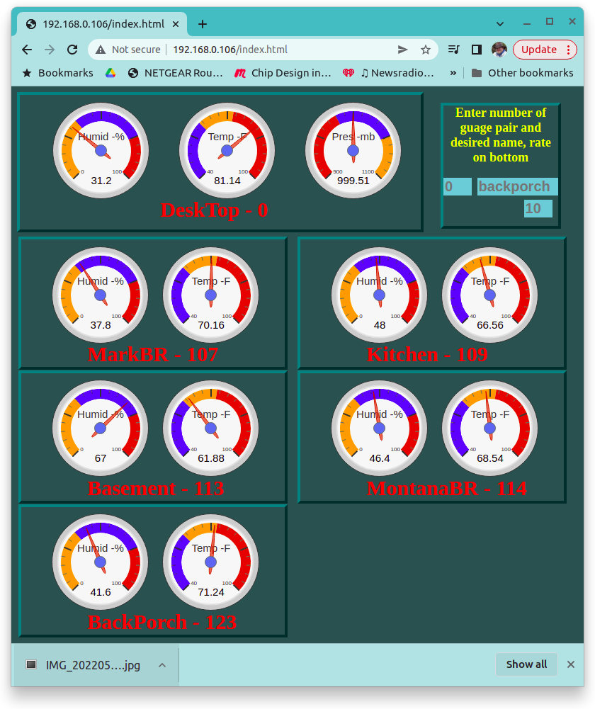
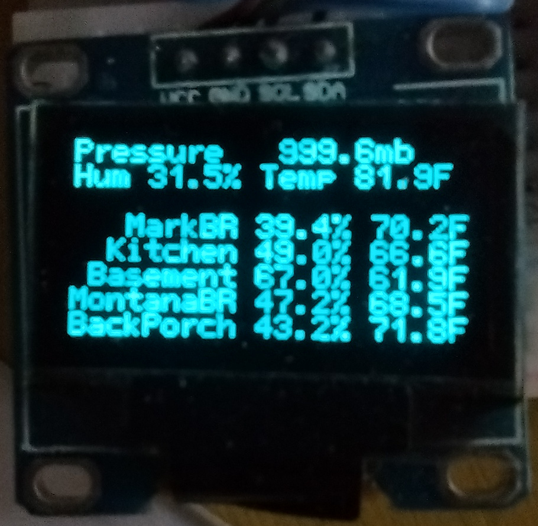

## Home Environment Monitor
</img>
##### A system is presented that connects a group of remote clients, each having several sensors, distributed over a local area network with a base station that collects and reports the collected data. The remote clients, at a periodic rate, collect their data and report it to the base server as a tcp client. The tcp server in the base station responds with the remote stations assigned name and the rate at which to collect data. The base server stores the latest data from all the remote clients as well as its' own sensors data. A client request from a browser, or a netcat command from a pc, will cause the server to return the data from all of the sensors on the network. An index.html file is shown that displays this data with google visualization gauges and a perl program is described that collects the sensor data, time stamps it and stores it in file.
##### The system is implemented with an esp32 wroom as the base server with the remotes being various types of esp8266 modules at hand (mostly mini D1s, a nodeMCU and a few esp01s). Sensors included in project included one bmp280 atmospheric pressure sensor and an handful of humidity/temperature sensors (ath10, dht11 and dht22s). The host esp32 is running a tcp server task and periododicly interfaces with three on board i2c devices - data is collected from an aht10 (humidity and temperature) and a bmp280 (atmospheric pressure) sensor - data is written to a ssd1306 display. A potentially large number of remote esp8266s, running a tcp client, are equiped with a humity and temperature sensor and distributed around the house. The software for the esp8266 remotes is stored in a repository at https://github.com/baetis-ma/home_env_client.
#### The Remote Client
##### The esp8266 remote module spends most of its time in `vTaskDelay(rate*1000)`, when this this function exits the module collects data from the attached humidity/temperature sensor and generates a string like the following - `client?113,192.168.0.113,Basement,670,173`. The esp then opens an ip socket to the host address, connects and sends the string. The ip address of the base station server is stored in the esp8266 code. The remotes' socket soon receives a response from the base station sever like the following - `113,Basement,60`.
##### The string that the remote sends, `client?113,192.168.0.113,Basement,670,173`, contains a url name to tell the server the packet type, followed by a question mark. The url resources remaing in the string contain: the remotes current registration id, the remotes ip address, the remotes current name, and the measured - ten times the humidity% and ten times the temperature in C. The registration number of the remotes are assigned by the base and defaults to zero at startup. The open ip socket will receive a return string, such as `113,Basement,60`, the remote reads this as registration id = 113, remote station name = Basement and the current update rate is 60 seconds.
#### The Base Station Server
##### The base station server is typically in a state of listening for tcp connections, also every couple minutes it make measurements of it attached sensors and updates the oled display.The esp32 tcp base server receives three different types of requests, namely 
##### 1- an index.html request (typically from browser - sends multiple packets from esp eprom), 
```
GET /index.html HTTP/1.1
Host: 192.168.0.106
User-Agent: curl/7.68.0
```
###### The esp32 responds with an index.html file (9.2Kbytes - stored esp32 eprom) split up into a half dozen or more packets to a browser making the request. The index.html file contains static html and sytle insctuctions as well as an embedded active javascript program that periodically polls the base server for new data and updates the web page.
##### 2- a remote client packet as described above
```
GET /client?113,192.168.0.113,Basement,670,173 HTTP/1.1
Host: 192.168.0.106
User-Agent: curl/7.68.0
```
###### The esp32 responds with a packet containing something like `113,Basement,60`, again described above.
##### 3- or a 'host' request to read the collected sensor data and assign remote variables; 
```
GET /host?113,Basement,60 HTTP/1.1
Host: 192.168.0.106
User-Agent: curl/7.68.0
```
###### The esp32 base station will interpet this packet as - make name of station at regisration address 'Basement' and - make 60 seconds the data collection and reporting rate system wide. The esp32 will respond with a packet including the string : 
`5, host,480,247,99687,107, MarkBR,454,252,108, MontanaR,468,250,109, Kitchen,540,233,113, Basement,690,173,123, BackPorch, 398,239`
###### The first number is the number of attached remotes, second field is name of base station followed by its humidity, temperature and pressure measurements. Next is the name of remotes station one followed by its' humidity and temperature measurements, the sequence repeats for each assigned remote esp8266 module.
##### The third type of client request is used to collect data from the base station and to set variables across the system (i.e. remote stations names and data collection rate). This type of request originates from the JavaScript within the index.html being run in a browser, from a perl program running netcat commands every few minutes for the purpose of data logging or a simple terminal command line curl command. 
##### A tcp request not meeting one of these criteria will get a 404 error return web page, `<html><h1>Not Found 404</html>`.
</img>
##### The active webpage displays the state of all the sensor measurements across the system with Google chart gauge visualizations, as new remotes are added new gauges appear on webpage and as gauges timeout they go offline. The webpage also includes text action boxes for station naming - for example stations can be named backporch or kitchen, ect. The remote station will retain its name is the base station is momentarily shut down, also the base stattion will remember station names of remotes. The rate of data aquistion is also set at this level. The oled display also shows the measurement data.
##### A perl program is used to log sensor data across the system. It can be set to collect data every 10 minutes, for example, and save data to disk. Notice that the webpage gives a snapshot updated every few seconds or minutes while the perl program provides a history of weeks or months worth of data.
```perl
#!/usr/bin/perl
use strict;
use warnings;
use POSIX qw/strftime/;

my $ret = `printf "GET /host?0,host,8 HTTP/1.0\r\n\r\n" | nc 192.168.0.106 80`; 
$ret =~ tr/ //ds;
my @inarray = split (/,/, $ret);

printf("%s  ", strftime('%Y/%m/%d  %H:%M:%S',localtime));
print "@inarray";

open(FH, '>>', "./save/${inarray[1]}.pressure");
printf  FH "%s %s\n", strftime('%Y/%m/%d  %H:%M:%S',localtime), $inarray[4];
open(FH, '>>', "./save/${inarray[1]}.hum");
printf  FH "%s %s\n", strftime('%Y/%m/%d  %H:%M:%S',localtime), $inarray[2];
open(FH, '>>', "./save/${inarray[1]}.temp");
printf  FH "%s %s\n", strftime('%Y/%m/%d  %H:%M:%S',localtime), $inarray[3];

for(my $a=1; $a <= $inarray[0]; $a++) {
   open(FH, '>>', "./save/${inarray[5 + 3*($a-1)]}.hum");
   printf  FH "%s %s\n", strftime('%Y/%m/%d  %H:%M:%S',localtime), $inarray[6 + 3*($a-1)];
   open(FH, '>>', "./save/${inarray[5 + 3*($a-1)]}.temp");
   printf  FH "%s %s\n", strftime('%Y/%m/%d  %H:%M::%S',localtime), $inarray[7 + 3*($a-1)];
}
```
##### This program can be run with the `watch -n 120 ./collectdata.pl` on the command line, it will collect data every two minutes and store each sensor reading in separate files in the ./save directory. The datastamp format in the files can be read with gnuplot programs like the following
```gnuplot
#!/usr/bin/gnuplot -p
     set xdata time
     set timefmt "%Y/%m/%d"
     set yrange[0:1000]
     set format x "%m/%d\n%H:%M"
     set timefmt "%Y/%m/%d %H:%M:%S"
     plot "DeskTop.hum"     u 1:3 ,\
          "BackPorch.hum"   u 1:3 ,\
          "MontanaR.hum"    u 1:3 ,\
          "Basement.hum"    u 1:3 ,\     
          "Kitchen.hum"     u 1:3 ,\
          "MarkBR.hum"      u 1:3 
```
##### The esp portion of the project is written in the espressif idf envirornment. The project functionality was merged from various examples included with the idf distribution, specifically the wifi connection example was used with little alteration. The i2c and tcp server examples were modified to suit purposes. Pretty much all the rest of the software is written from scratch. idf drivers for the dhts11/22, aht10, bmp280 and ssd1306 were either unavailable or too confusing (several of these devices have aweful datasheets also). The repository https://github.com/baetis-ma/esp32-max30102-website and the github page at https://baetis-ma.github.io/esp32-idf-website/ describe getting started with esp idf with a simple webpage.
